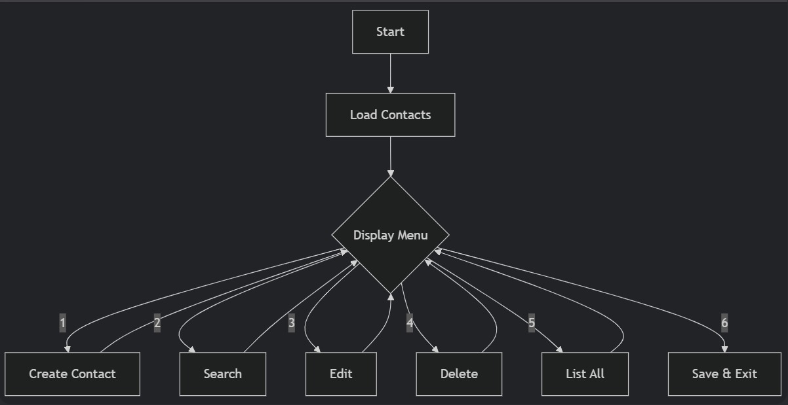

# Address-Book-Project
A CLI-based contact manager built in C under Emertxe's Advanced C constraints. Features full CRUD operations, input validation, and CSV-style file persistence. Uses structures and standard file I/O to manage contacts efficiently.

**Name:** Rehan Mokashi  
**Date of Submission:** 08/July/2025  

## Description
This Address Book project is a C program that allows users to manage their contacts efficiently. It provides functionality to create, search, edit, delete, and list contacts. The program features robust input validation and persists data by saving contacts to a CSV file.

Key features:
- Contact management with name, phone, and email fields
- Comprehensive input validation for all fields
- Case-insensitive search functionality
- Data persistence through file I/O operations
- User-friendly menu interface

## File Structure
```
contact.h       - Header file with data structures and function declarations
contact.c       - Implementation of contact management functions
file.h          - Header for file operations
file.c          - Implementation of file I/O functions
main.c          - Main program with menu interface
populate.h      - Header for dummy data population
populate.c      - Dummy contact data for testing
contacts.csv    - Data file storing contacts in CSV format
```

## Sample Input/Output

### Sample Input 1: Creating a Contact
```
Address Book Menu:
1. Create contact
2. Search contact
3. Edit contact
4. Delete contact
5. List all contacts
6. Exit
Enter your choice: 1

Enter name: Rehan Mokashi
Enter phone number (10 digits): 9370409503
Enter email: rehanmokashi786@gmail.com
Contact added successfully!
```

### Sample Output 1: Listing Contacts
```
Address Book Menu:
1. Create contact
2. Search contact
3. Edit contact
4. Delete contact
5. List all contacts
6. Exit
Enter your choice: 5

No.  Name                 Phone          Email                         
-----------------------------------------------------------
1    Rehan Mokashi        9370409503     rehan786@gmail.com           
2    Rohit                1234567898     amit_01@gmail.com            
3    Shahid               7777852414     shahid@gmail.com             
4    Nihal                7777888822     nihal.m@gmail.com            
5    Shahid               9999999998     shahid123@gmail.com          
6    mouli                1234567895     sr5@j.com                    
7    Sample               5555555555     kk@gmail.com                 
8    mple                 5555555548     sample@gmail.com             
9    KK                   5469875215     samplefork@gmail.com         
10   hello                1234567890     hello@g.com                  
11   Amit                 1234567892     amit@g.com                   
12   jj                   1234567894     helo@gmail.com               
13   Jane Smith           9876543210     jane.smith@gmail.com         
-----------------------------------------------------------
Total contacts: 13
```

### Sample Input 2: Searching Contacts
```
Address Book Menu:
1. Create contact
2. Search contact
3. Edit contact
4. Delete contact
5. List all contacts
6. Exit
Enter your choice: 2

Search by:
1. Name
2. Phone
3. Email
4. Back to Menu
Enter your choice (1-4): 1
Enter search term: shahid

Search results for "shahid":
-----------------------------------------------------------
Name                 Phone          Email                         
-----------------------------------------------------------
Shahid               7777852414     shahid@gmail.com             
Shahid               9999999998     shahid123@gmail.com          
-----------------------------------------------------------
Found 2 matches.

Search again? (y/n): n
```

### Sample Input 3: Editing a Contact
```
Address Book Menu:
1. Create contact
2. Search contact
3. Edit contact
4. Delete contact
5. List all contacts
6. Exit
Enter your choice: 3

Edit by:
1. Name
2. Phone
3. Email
4. Cancel
Enter your choice: 1
Enter search term: Jane Smith

Found 1 matching contact:

Editing contact:
1. Name: Jane Smith
2. Phone: 9876543210
3. Email: jane.smith@gmail.com
4. Cancel
Select field to edit (1-4): 1
Enter new name: Jane Doe

Contact updated successfully!
```

### Sample Input 4: Deleting a Contact
```
Address Book Menu:
1. Create contact
2. Search contact
3. Edit contact
4. Delete contact
5. List all contacts
6. Exit
Enter your choice: 4

Delete by:
1. Name
2. Phone
3. Email
4. Cancel
Enter your choice: 2
Enter search term: 1234567890

Found 1 matching contact:

Contact to be deleted:
Name: hello
Phone: 1234567890
Email: hello@g.com

Are you sure? (y/n): y

Contact deleted successfully!
```

### Sample Input 5: Exiting the Program
```
Address Book Menu:
1. Create contact
2. Search contact
3. Edit contact
4. Delete contact
5. List all contacts
6. Exit
Enter your choice: 6
Saving and Exiting...
Contacts saved to contacts.csv successfully!
```

